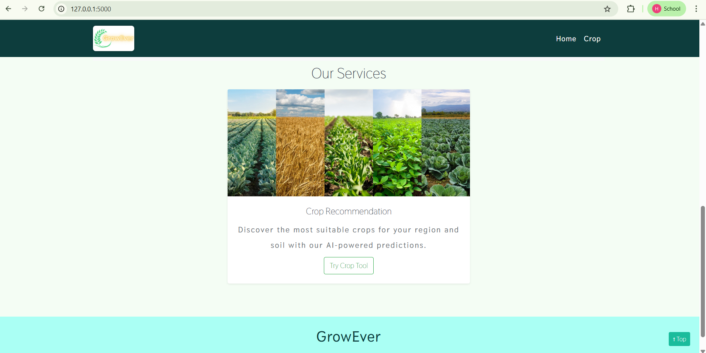

# 🌾 Crop Recommendation System

A Machine Learning-based Crop Recommendation System that predicts the most suitable crop to grow based on soil nutrients and environmental conditions. This project helps farmers and agricultural planners make data-driven decisions for better productivity and sustainable farming.

## 📌 Features

- Predicts the best crop based on soil and weather conditions
- Uses Machine Learning algorithms for accurate recommendations
- User-friendly input system for crop prediction
- Data preprocessing and model training pipeline included
- Easy to run locally and extend for future improvements

---

## 🛠️ Technologies Used

- **Python**
- **Pandas** – Data preprocessing
- **NumPy** – Numerical computations
- **Scikit-learn** – Machine Learning model training
- **Matplotlib / Seaborn** – Data visualization
- **Jupyter Notebook** – Model development
- **Flask / Streamlit** *(if used in your project)* – Deployment interface

---

## 📊 Input Parameters

The model predicts crops based on the following parameters:

- Nitrogen (N)
- Phosphorus (P)
- Potassium (K)
- Temperature
- Humidity
- pH
- Rainfall

---

## 🎯 Output

The system recommends the most suitable crop for the given soil and environmental conditions.

Example:

```text
Input:
N = 90
P = 42
K = 43
Temperature = 20.8
Humidity = 82
pH = 6.5
Rainfall = 202

Output:
Recommended Crop = Rice 🌾
```

---

## 📂 Project Structure

```bash
Crop-Recommendation/
│── data/                   # Dataset files
│── notebooks/             # Jupyter notebooks
│── models/                # Saved trained model
│── app.py                 # Main application
│── requirements.txt       # Dependencies
│── README.md              # Project documentation
```

---

## ⚙️ Installation

### 1. Clone the repository

```bash
git clone https://github.com/HariShankarLB/Crop-Recommendation.git
cd Crop-Recommendation
```

### 2. Create a virtual environment (optional)

```bash
python -m venv venv
source venv/bin/activate      # Linux/Mac
venv\Scripts\activate         # Windows
```

### 3. Install dependencies

```bash
pip install -r requirements.txt
```

---

## ▶️ Run the Project

If using a Python script:

```bash
python app.py
```

If using Jupyter Notebook:

```bash
jupyter notebook
```

---

## 🤖 Machine Learning Workflow

1. Data Collection
2. Data Preprocessing
3. Exploratory Data Analysis (EDA)
4. Feature Selection
5. Model Training
6. Model Evaluation
7. Crop Prediction

---

## 📈 Model Performance

Metrics used for evaluation:

- Accuracy Score
- Confusion Matrix
- Classification Report

> Add your actual model accuracy here (Example: **Accuracy: 97.3%**)

---

## 📷 Screenshots

Add screenshots of your application here:

```markdown


```

---

## 🚀 Future Improvements

- Real-time weather API integration
- Mobile-friendly web interface
- Fertilizer recommendation module
- Crop yield prediction
- Multi-language support for farmers

---

## ⭐ Support

If you found this project useful, please give it a ⭐ on GitHub!
